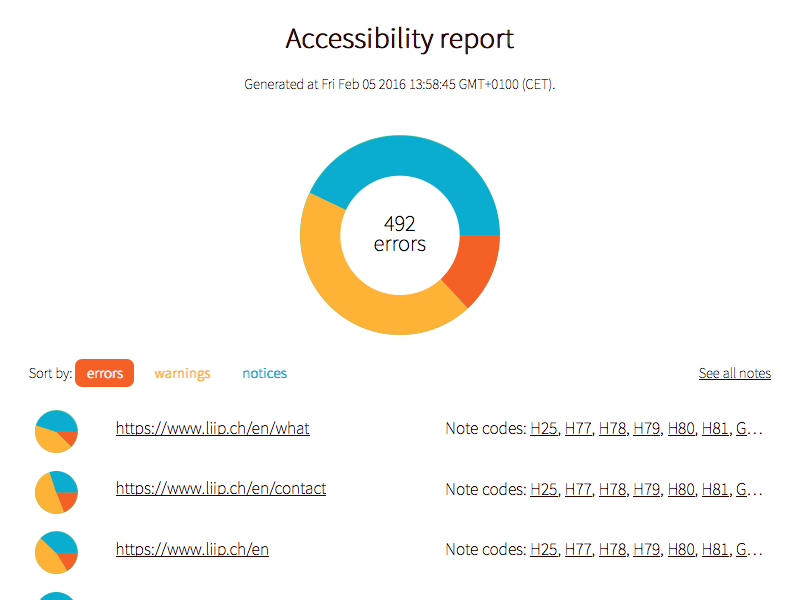

# The A11y Machine

**The A11y Machine** is an **automated accessibility testing tool** which
**crawls** and **tests** all pages of any web application. It validates pages
against the following specifications/laws:

  * [W3C Web Content Accessibility Guidelines](http://www.w3.org/TR/WCAG20/)
    (WCAG) 2.0, including A, AA and AAA levels ([understanding levels of
    conformance](http://www.w3.org/TR/UNDERSTANDING-WCAG20/conformance.html#uc-levels-head)),
  * U.S. [Section 508](http://www.section508.gov/) legislation.

## Installation

[NPM](http://npmjs.org/) is required. Then, execute the following lines:

```sh
$ npm install -g phantomjs
$ npm install the-a11y-machine
```

## Usage

First, see the help:

```sh
$ ./a11ym --help

  Usage: a11ym [options] url …

  Options:

    -h, --help                         output usage information
    -c, --filter-by-codes <codes>      Filter results by comma-separated WCAG codes (e.g. `H25,H91,G18`).
    -C, --exclude-by-codes <codes>     Exclude results by comma-separated WCAG codes (e.g. `H25,H91,G18`).
    -l, --level <level>                Level of message to fail on (exit code 2): `error` (default), `warning`, `notice`.
    -d, --maximum-depth <depth>        Explore up to a maximum depth (hops).
    -m, --maximum-urls <maximum_urls>  Maximum number of URLs to compute.
    -o, --output <output_directory>    Output directory.
    -r, --report <report>              Report format: `cli`, `csv`, `html` (default), `json` or `markdown`.
    -s, --standard <standard>          Standard to use: `Section508`, `WCAG2A`, `WCAG2AA` (default), ` WCAG2AAA` or your own (see `--sniffers`).
    -S, --sniffers <sniffers>          Path to the sniffers file, e.g. `resource/sniffers.js` (default).
    -u, --filter-by-urls <urls>        Filter URL to test by using a regular expression without delimiters (e.g. 'news|contact').
    -U, --exclude-by-urls <urls>       Exclude URL to test by using a regular expression without delimiters (e.g. 'news|contact').
```

Then, the simplest use is `a11ym` with an URL:

```sh
$ ./a11ym http://example.org/
```

All URLs accessible from `http://example.org/` will be tested. See the
`--maximum-urls` options to reduce the number of URLs to test.

Then open `a11ym_output/index.html` and browser the result!

### List of URLs instead of crawling

You can compute several URLs by adding them to the command-line, like this:

```sh
$ ./a11ym http://example.org/A http://example.org/B http://example.org/C
```

Alternatively, this is possible to read URLs from STDIN, as follows:

```sh
$ cat URLs.lists | ./a11ym -
```

Note the `-`: It means “Read URLs from STDIN please”.

When reading several URLs, the `--maximum-depth` option will be forced to 1.

## Possible output

The index of the reports:



Report of a specific URL:


## How does it work?

The pipe looks like this:

  1. We use
     [`node-simplecrawler`](https://github.com/cgiffard/node-simplecrawler/) to
     crawl a web application based on the given URL,
  2. For each URL found, we run [PhantomJS](http://phantomjs.org/) and inject
     [`HTML_CodeSniffer`](https://github.com/squizlabs/HTML_CodeSniffer) that
     will check the page conformance; This step is semi-automated by the help of
     [`pa11y`](https://github.com/nature/pa11y), which is a very thin layer of
     code wrapping PhantomJS and `HTML_CodeSniffer`,
  3. Finally, we transform the results produced by `HTML_CodeSniffer` to produce
     enhanced and easy to use reports.

So basically, The A11y Machine puts `node-simplecrawler` and `pa11y` (so
`HTML_CodeSniffer` and PhantomJS) together and provides cool reports! Moreover,
the command-line provides useful options to work efficiently and pragmatically,
like the `--filter-by-codes` option.

## Write your custom sniffers

`HTML_CodeSniffer` is build in a way that allows you to extend existing sniffers
or write your own. The `resource/sniffers/` directory contains an example of a
custom sniffer.

The A11y Machine comes with a default file containing all the sniffers:
`resource/sniffers.js`. You can provide your own by using the `--sniffers`
option. To build your own sniffers, simply copy the `resource/sniffers/`
somewhere as a basis, complete it, then compile it with
[Grunt](http://gruntjs.com/) (you need to install Grunt with `npm install -g
grunt-cli`):

```sh
$ grunt --sniffers-directory my/sniffers/ --sniffers-output my_sniffers.js
```

Then, to effectively use it:

```sh
$ ./a11ym --sniffers my_sniffers.js --standard MyStandard http://example.org/
```

## License

[BSD-3-Clause](http://opensource.org/licenses/BSD-3-Clause):

> Copyright (c) 2016, Ivan Enderlin and Liip
> All rights reserved.
>
> Redistribution and use in source and binary forms, with or without modification,
> are permitted provided that the following conditions are met:
>
> 1. Redistributions of source code must retain the above copyright notice, this
>    list of conditions and the following disclaimer.
>
> 2. Redistributions in binary form must reproduce the above copyright notice,
>    this list of conditions and the following disclaimer in the documentation
>    and/or other materials provided with the distribution.
>
> 3. Neither the name of the copyright holder nor the names of its contributors
>    may be used to endorse or promote products derived from this software without
>    specific prior written permission.
>
> THIS SOFTWARE IS PROVIDED BY THE COPYRIGHT HOLDERS AND CONTRIBUTORS "AS IS" AND
> ANY EXPRESS OR IMPLIED WARRANTIES, INCLUDING, BUT NOT LIMITED TO, THE IMPLIED
> WARRANTIES OF MERCHANTABILITY AND FITNESS FOR A PARTICULAR PURPOSE ARE
> DISCLAIMED. IN NO EVENT SHALL THE COPYRIGHT HOLDER OR CONTRIBUTORS BE LIABLE FOR
> ANY DIRECT, INDIRECT, INCIDENTAL, SPECIAL, EXEMPLARY, OR CONSEQUENTIAL DAMAGES
> (INCLUDING, BUT NOT LIMITED TO, PROCUREMENT OF SUBSTITUTE GOODS OR SERVICES;
>  LOSS OF USE, DATA, OR PROFITS; OR BUSINESS INTERRUPTION) HOWEVER CAUSED AND ON
> ANY THEORY OF LIABILITY, WHETHER IN CONTRACT, STRICT LIABILITY, OR TORT
> (INCLUDING NEGLIGENCE OR OTHERWISE) ARISING IN ANY WAY OUT OF THE USE OF THIS
> SOFTWARE, EVEN IF ADVISED OF THE POSSIBILITY OF SUCH DAMAGE.
